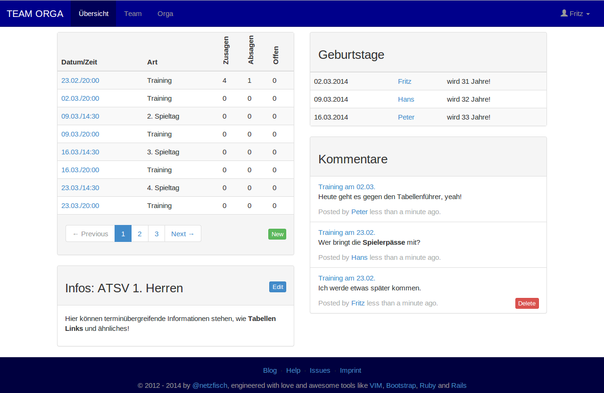
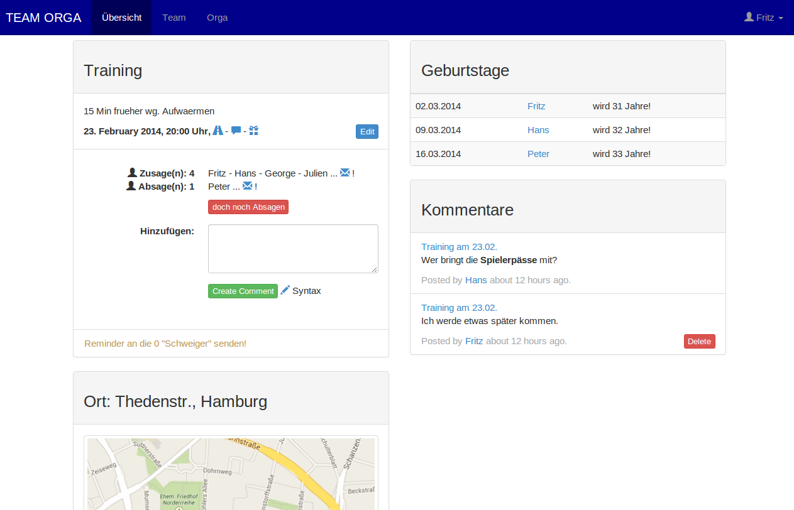

# TEAM ORGA

This is the source for a **web application to organize closed, not publicly
groups**, secured with a basic authentication. Following features are available:

* create a not publicly group and **manage group data**,
* **register** as new **user** and create a profile,
* **invite** new, more group **members**,
* list group members,
* make **repeating events**,
* **accept** or **deny participation** of a event,
* use event specific **mail lists** for accepter, refuser, sleeper,
* create **comments** based on a single event,
* see upcomming **birthdays** of fellows,
* manage data within a simple [backoffice](#backoffice) interface.

Event-Overview                                              | Event-Details
----------------------------------------------------------- | -------------------------------------------------------
 | 

Originally I started this project for my private sports group as a standalone
version. But meanwhile there is also a **multitenant software as a service version**,
which currently is in **private beta**. If you want to participate ping me for an **invitation**.

# Getting Started

This project uses [Ruby](http://ruby-lang.org) on
[Rails](http://rubyonrails.org) and twitter
[bootstrap](https://github.com/twitter/bootstrap) for the responsive frontend
part.

Development was mainly test-driven done with
[RSpec](https://www.relishapp.com/rspec/) and [Factory
Girl](https://github.com/thoughtbot/factory_girl). I also wrote a few user
stories or more accurate feature specs to exercise slices of functionality
through the entire application, which requires
[Capybara](https://github.com/jnicklas/capybara) to drive the application via
its external interface the web pages.

### Fork and Clone

There are just a couple of steps to get your private team organisation alive.
Fork this repo at GitHub and than

    $ git clone git@github.com:YOUR-USERNAME/teamorga.git
    $ bundle install --without production
    $ rake db:migrate

### Testing

Check the specs in the console by

    $ rake db:test:prepare
    $ guard

### Development

You don't need to setup a fake group with users, to see what it feels like.
Just seed the exisiting data

    $ rake db:drop
    $ rake db:migrate
    $ rake db:seed

or as one-liner `$ rake db:drop db:migrate db:seed`, which is much faster!
Than we use foreman to start all processes via a 'Procfile' instead doing `$ rails server`:

    $ foreman start

Access the application via [http://localhost:5000](http://localhost:5000).
Reach the console via `$ foreman run rails console` or `$ rails console`.

### Staging / Production

For example deploy at heroku

```sh
$ git init
$ git add .
$ git commit -m "init new team organisation"
$ heroku create
$ git push heroku master
$ heroku run rake db:migrate
```
If erverything runs fine, heroku launches your application and "informs" you
about the live url.

# Backoffice

The application comes with a basic admin interface to manage model data (CRUD):

* Groupdata
* Members
* Events
* Recurrences
* Comments

In order to access the administration stuff, you need to be a registered user
with the "admin role". The first admin needs to be created manual within the console

    $ heroku run rails console
    u = User.where(name: 'Fritz').first
    u.update_attributes(admin: true)
    u.save

or via seeding data as described above!

# Contribution

Bugs and feature requests can be filed via GitHub's [Issue
Tracker](https://github.com/netzfisch/teamorga/issues).  
Pull-request are welcome:

1. Fork it
2. Create your feature branch: `$ git checkout -b my-new-feature-branch`
3. Commit your changes `$ git commit -a -m 'add some awesome feature'`
4. Push to the branch `$ git push origin my-new-feature-branch`
5. Create a new pull request

# License

TEAM ORGA may be redistributed under the terms specified in the
[LICENSE](LICENSE) file.
